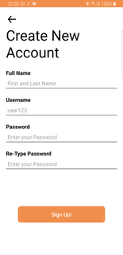
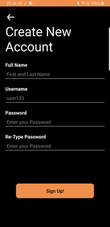
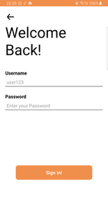
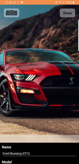
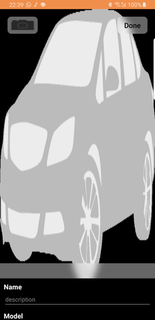
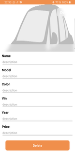
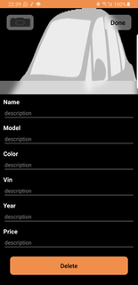

# Car Inventory
This is an Andorid application to maintain car inventory in application. It uses Google Room Library to store car information and images.
 iOS version: [Link](https://github.com/chaitanyasanoriya/Car-Inventory-iOS)
 
The application has the following basic functionalities.
- Startup Screen
- Registration Screen
- Login Screen
- Browsing Cars Screen
- Car Details Screen
- Add Cars (For Manager)
- Modify Cars (For Manager)
- Remove Cars (For Manager)

### Startup Screen
The Screen contains two buttons for Login and Sign Up, each is clickable for their specific functions. Each Screen is either usable by either manager or a normal user.

  

 

### Registration Screen
The screen asks user to enter full name, username, password and a re-type password. The application first checks if all the data is entered, where ever the data is not entered the phone vibrates and the empty text field shakes. Next, the application checks if the password matches with the re-typed password or not. Next, the application checks if the username is already in use or not. If none of these problem arises the user is registered. While registering the password is converted in SHA—256 hash for storage

  

 

Process of Registration also has some checks, the process is as follows:
1. Check If Text Fields are empty
1. Check if password match
1. Check if the user name is already in use
1. Sign Up User

  

 
### Login Screen
The screen asks user to enter username and password. The application checks if the username, password pair exists in the database. If it does, it is checked if the user is a manager or not. The application only has one manager account with Username “manager” and Password “Test”. If the user is manager, this information is saved into application session.
 

  

 

### Browsing Car Screen
The Screen uses Recycler View to show cars. The Recycler View uses a custom Cell, with a minimalist design, which shows the image of the car along with name and price.
The Cell contains a separate Card View, which can be slide up to show more information about the car, while the image of the car is faded. The Cell also has the animation which is that the cards presses down when pushed or hold onto. Clicking on the Cells takes you onto a Screen which shows more information about the car. The Screen also contains a search bar which can be used to filter the results.
 

  

 

This screen has two versions
- For Manager
- For User

The only difference between these two screens is that the user does not have a button to get add a new car
 

  
  &#09;&#09;
  

 

### Car Details Screen
The Screen uses Information about the car. The Cell contains a separate Card View, which can be slide up to show more information about the car, while the image of the car is faded. 
 

  

 

This screen has two versions
- For Manager
- For User

The only difference between these two screens is that the information in manager version is editable and is used to modify the car details. This same screen is also used to add new cars with blank details.
 

  
  &#09;&#09;
  

 

### Add Car
A car can only be added by the manager. It uses the same Car Details Screen but all the data is blank while trying to add car. The application uses Car Vin as a unique number, therefore no two cars can have the same Vin. When a new car is being added and has the same Vin as existing car it gives an error. The application can also fetch car image from Gallery or Camera, but the image is not necessary to add a new car in the inventory. 
 

  

 

### Modify Car
A car can only be modified by the manager. It uses the same Car Details Screen but data is editable. The application uses Car Vin as a unique number, therefore while modifying a car Vin not modifiable.
 

  

 

### Remove Car
A car can only be removed by the manager. It uses the same Car Details Screen but data is editable. Under the editable details, there is a delete button which deletes the car.
 

  

 

## Subtle Features
The Application contains some subtle UX features, such as:
- Password is Stored as SHA-256 Hash
- Splash Screen
- Dynamic Shadow under Recycler View
- Empty TextFields Shake and vibrate phone
- Recycler View Contains another View inside to display car details
- Cells held animation
- Default Cell
- Tapping Anywhere hides keyboard

### Password is Stored as SHA-256 Hash
The Password entered and stored is converted in SHA-256 hash for security
 

  

 

### Splash Screen
It Shows the application logo before the actual application
 

  

 

### Dynamic Shadow
The shadow color changes depending upon Light Mode and Dark Mode
 

  
  &#09;&#09;
  

 

### Empty TextFields
Empty TextFields Shake and vibrate phone. It is done by writing an extension to UIView and adding animations to them. The Vibration is achieved by AudioServicesPlaySystemSound.
 

  
  &#09;&#09;
  

 

### Car Details
Recycler View Contains another View inside to display cars. This is done by adding a View  as a sub view of the cell itself. 
 

  

 

### Default Cell
If there are no cars in inventory, the application shows a default cell that says ”No car in inventory”
 

  

 

### Tapping Anywhere hides keyboard
When keyboard is visible and the user taps anywhere else the keyboard hides
 

  

 

## Dark Mode Supported
The application supports Dark Mode with Multiple drawable files and color files

 

  
  &#09;&#09;
  
  &#09;&#09;
  
  &#09;&#09;
  
  &#09;&#09;
  
  &#09;&#09;
  
  &#09;&#09;
  
  &#09;&#09;
  
  &#09;&#09;
  
  &#09;&#09;
  
  &#09;&#09;
  
  &#09;&#09;
  
  &#09;&#09;
  
  &#09;&#09;
  
  &#09;&#09;
  
  &#09;&#09;
  
  &#09;&#09;
  
  &#09;&#09;
  
  &#09;&#09;
  
  &#09;&#09;
  

 

## Manager Credentials
The application has hardcoded manager credentials, which are:
 
Username: manager
 
Password: test
